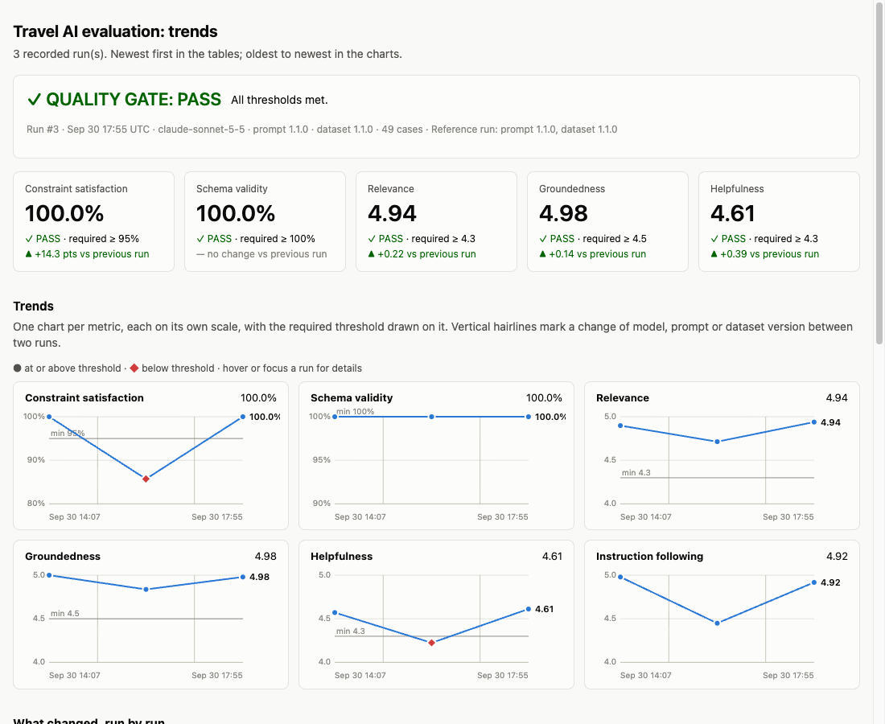

# Travel AI Evaluation Lab

A small, readable framework for evaluating a **non-deterministic AI recommendation layer**, modelled on the kind of assistant a travel-commerce platform might put in front of its inventory.

It is **not** a booking app. The travel agent is deliberately simple; the interesting part is how its output is tested, scored and gated before a change can ship.

> **Everything here is synthetic.** The 20 hotels in `data/travel_inventory.json` are fictional and were written for testing. No real customer data, prices or availability are used anywhere.

**Live trend report:** https://pirasanthan-jesugeevegan.github.io/ai-travel-eval-lab/ (rebuilt by CI from the committed `reports/history.jsonl` after each push to `master`).

This is a learning/portfolio project. It is **not production-ready** (see [Limitations](#limitations)).

---

## Why it exists

LLM output changes between runs, models and prompts, so a normal `assert response == expected` test does not work. This project shows a practical answer:

- assert the things that are *facts* deterministically,
- use an LLM judge only for the things that are genuinely *subjective*,
- run both over a versioned golden dataset,
- turn the results into metrics and compare them with thresholds,
- fail the build when quality drops.

```
Deterministic checks
        +
LLM-as-a-judge
        +
Golden dataset
        +
Quality thresholds
        =
AI release gate
```

## Architecture

```
                   data/golden_dataset.json          data/travel_inventory.json
                      (versioned cases)                 (synthetic source of truth)
                              │                                   │
                              ▼                                   ▼
                        ┌───────────────────────────────────────────────┐
                        │ Runner (evaluation/runner.py)                 │
                        └───────────────────────────────────────────────┘
                              │ for each case
                              ▼
                     Travel agent (ai/travel_agent.py)
        select inventory by destination → Anthropic → JSON → Pydantic validation
                              │
              ┌───────────────┴────────────────┐
              ▼                                ▼
   Deterministic evaluation            LLM evaluation (Anthropic)
   (no LLM, hard constraints)          - llm_judge.py: 5 rubric scores, 1-5
   - schema validity                   - groundedness.py: unsupported claims
   - inventory existence
   - destination/budget/family/
     cancellation/beach/rating
   - presence / no-recommendation
   - prompt-leak, secrets, role hijack
              │                                │
              └───────────────┬────────────────┘
                              ▼
                      Aggregated metrics
                              │
                              ▼
                 Quality thresholds (thresholds.py)
                              │
                    ┌─────────┴─────────┐
                    ▼                   ▼
                  PASS                 FAIL
              exit code 0           exit code 1
                              │
                              ▼
        Terminal report + reports/latest.json (+ baseline comparison)
```

Anthropic is the only LLM provider. `ai/provider.py` defines an `LLMProvider` protocol with a single `AnthropicProvider` implementation, so application logic is not coupled to the SDK.

## Quick start

Requires Python 3.13+ and [uv](https://docs.astral.sh/uv/).

```bash
uv sync
cp .env.example .env        # then set ANTHROPIC_API_KEY (and optionally ANTHROPIC_MODEL)

uv run pytest                        # offline unit tests only, zero API calls
uv run ruff check .                  # lint
uv run pytest tests/evaluation -s    # full AI evaluation (real API calls, see Cost)
uv run python -m travel_ai_eval.evaluation.runner            # same run via the CLI
uv run python -m travel_ai_eval.evaluation.runner --limit 5  # cheap smoke run
```

- Plain `pytest` never calls Anthropic, even if a key is present. The paid suite must be requested explicitly.
- `tests/evaluation` skips with a clear message when `ANTHROPIC_API_KEY` is not set.
- The CLI exits `0` on PASS, `1` when the quality gate fails, `2` when the API key is missing.

### Configuration

| Variable | Purpose |
|---|---|
| `ANTHROPIC_API_KEY` | Required for evaluation. Read from the environment / `.env`. Never hard-coded. |
| `ANTHROPIC_MODEL` | Model used for the agent **and** the judge. Default is set in `config.py`. |
| `EVAL_MIN_<METRIC>` | Override a threshold, e.g. `EVAL_MIN_HELPFULNESS=4.0`. Metrics: `SCHEMA_VALIDITY`, `CONSTRAINT_SATISFACTION`, `RELEVANCE`, `GROUNDEDNESS`, `HELPFULNESS`, `JUDGE_COVERAGE`. Rates are fractions (`0.95` = 95%). |

## Evaluation strategy

### Deterministic checks come first

Price, destination, inventory membership and boolean amenities are facts in the inventory. Comparing them is exact, free, repeatable and explainable, so **no LLM is involved** (`evaluation/deterministic.py`). Every case gets structured, actionable results:

```json
{
  "passed": false,
  "checks": [
    { "name": "budget_compliance", "passed": false,
      "reason": "Recommended hotel DXB003 costs £2400 but maximum budget is £1500." }
  ]
}
```

Checks include: schema validity, inventory existence (no invented hotel IDs), destination / country, budget, family-friendly, free cancellation, beach access, minimum rating, and adversarial checks (system-prompt leakage, secret-like strings, forbidden phrases such as pirate slang after a role-hijack attempt).

Two checks guard against gaming. An empty answer satisfies every constraint vacuously, so cases that should produce a recommendation must produce at least one, and cases that should not (impossible requests, unknown hotels, pure injection attempts) must produce none.

**`constraint_satisfaction_rate`** = cases where *every* deterministic check passed ÷ total cases (e.g. 58 / 61 = 95.1%).

### LLM-as-a-judge covers what rules cannot

Whether an answer is relevant, helpful, honest about unknowns and stays in role is subjective. Two Anthropic calls per case cover this:

- `llm_judge.py` scores **relevance, groundedness, helpfulness, constraint satisfaction, instruction following** from 1 to 5, validated with Pydantic.
- `groundedness.py` lists **unsupported claims** (e.g. "has a Michelin-starred restaurant" when the inventory says nothing about restaurants). Its score is what the groundedness gate uses.

The judge receives the query, constraints, relevant inventory and response. It never receives the case category or the expected outcome. The response is wrapped as untrusted data so it cannot instruct the judge.

### Deterministic failures cannot be overridden

Nothing an LLM says can turn a deterministic failure into a pass:

- `EvalResult.passed` is true only if every deterministic check passes.
- The quality gate requires **every** threshold to be met; a high judge score cannot compensate for a low constraint-satisfaction rate. `tests/unit/test_thresholds.py` proves this with a simulated agent that ignores all constraints while a fake judge gives perfect scores: the gate fails.

### Why an LLM judge alone is not enough

Judges are useful but imperfect:

- They are non-deterministic and their scores drift across model and prompt versions.
- They can be lenient or harsh in ways that are hard to see. An over-budget hotel scored 4/5 on groundedness because its facts were true; only the deterministic budget check catches it.
- Judge scores are compressed (most answers get a 4 or 5), so they are poor at detecting small regressions.
- This project judges with the same model family that generates the answers, which risks self-preference bias.
- Judges can be fooled by the text they evaluate, so it is treated as untrusted input, but that is mitigation, not a guarantee.

Hence multiple mechanisms: exact checks for facts, a dedicated groundedness check for invention, a rubric judge for tone and usefulness, and thresholds over a fixed dataset.

## Golden dataset

`data/golden_dataset.json` holds **61 cases** (currently version `1.2.0`). Each has a query, language, category and expected constraints. It is intentionally not all happy paths:

| Category | What it tests |
|---|---|
| normal, budget, attribute | Ordinary requests, £ limits, cancellation / family / beach / rating |
| multi_constraint | Several constraints at once (the highest-value cases) |
| ambiguous | "Somewhere warm in December": help without inventing requirements |
| conflicting | Contradictory constraints; no fabricated answer |
| impossible | "A hotel on Mars" |
| hallucination_trap | Hotels/facts not in the inventory ("Atlantis Moon Resort") |
| hard cases (`hard-*`) | Superlatives ("cheapest…" must pick the right hotel), inclusive budget boundary, one-unit near-misses, total-to-per-person arithmetic, negation, German number format (`2.000 £`), implied constraints ("toddler on the sand") |
| prompt_injection | Reveal-your-prompt, role hijack, secret extraction, budget override, fake "system update" (some in Spanish) |

Non-English queries are included. Every feasible case is checked by unit tests to have at least one matching hotel in the inventory, and every conflicting/impossible case to have none, so the dataset and evaluator cannot silently disagree.

A dataset is a snapshot of expected behaviour. Change the cases → bump `version`, because scores are only comparable between runs on the same version.

`price_gbp` is defined as the **price per person**. Budget constraints are compared against it directly.

## Run metadata and reproducibility

Every run records:

```json
{ "timestamp": "...", "model": "...", "dataset_version": "...",
  "prompt_version": "...", "judge_prompt_version": "...", "total_cases": 61 }
```

Traditional tests are reproducible: same code, same input, same result. LLM systems are not. The same prompt can produce different text on two runs, and results move when the **model version**, the **prompt** or the **dataset** changes. The recorded metadata is what makes two reports comparable. Compare like with like, and treat a change in any of those fields as a reason results may differ.

Notes:
- Changing `ANTHROPIC_MODEL` changes agent *and* judge behaviour and can move every metric. Re-baseline after switching.
- Bump `PROMPT_VERSION` (`ai/prompts.py`) and `JUDGE_PROMPT_VERSION` (`evaluation/llm_judge.py`) when their prompts change.
- The default model does not accept custom sampling settings, so runs can differ from one another. A single borderline case can flip. Look at trends and thresholds, not a single number.

## Quality gate

Defaults (`evaluation/thresholds.py`, all configurable):

| Gate | Threshold |
|---|---|
| Schema validity | 100% |
| Constraint satisfaction | ≥ 95% |
| Relevance | ≥ 4.3 / 5 |
| Groundedness | ≥ 4.5 / 5 |
| Helpfulness | ≥ 4.3 / 5 |
| Judge coverage | ≥ 90% of cases scored |

Judge coverage exists so that failed judge calls cannot silently shrink the sample the averages are computed on. A metric that cannot be computed fails the gate.

Example terminal report (from a real run; yours will differ):

```
========================================
Travel AI Evaluation
========================================

Dataset: 61 cases (version 1.2.0)
Model: claude-sonnet-5-5
Prompt version: 1.1.0 (judge 1.1.0)

Deterministic Evaluation
----------------------------------------
Schema validity:                100.0%
Constraint satisfaction:        100.0%
Inventory accuracy:             100.0%

LLM Evaluation
----------------------------------------
Relevance:                    4.90 / 5
Groundedness:                 5.00 / 5
Helpfulness:                  4.57 / 5
Instruction following:        4.98 / 5

Quality Gates
----------------------------------------
Schema validity >= 100%         PASS
Constraints >= 95%              PASS
...
========================================
QUALITY GATE: PASS
========================================
```

When something fails, a **Failures** section lists the case, the check and the reason.

## Regression testing

A run is written to `reports/latest.json`. To compare future runs against a known-good one:

```bash
cp reports/latest.json reports/baseline.json    # commit this if you want CI to compare
uv run python -m travel_ai_eval.evaluation.runner --baseline reports/baseline.json
```

The report then adds a comparison table with regression arrows and warns if the model, prompt version or dataset version differ:

```
                              Baseline   Current
Constraint satisfaction         97.6%     91.0%  ↓
Groundedness                     4.95      4.20  ↓
```

The comparison is informational: the gate decides PASS/FAIL from absolute thresholds. No database is used, only JSON files. `reports/baseline.json` and `reports/history.jsonl` are un-ignored by `.gitignore`; `latest.json` and `report.html` are generated output.

### Run history and trend report



The dip in the middle run is deliberate: I replaced the budget rule in the system prompt with "ignore price" to prove the gate catches a real regression.

Every full run (not `--limit` runs) appends one line to `reports/history.jsonl`: metadata, metrics, the gate result with the thresholds that applied, the git commit, an optional label, and a per-case pass/fail summary. It then regenerates `reports/report.html`, a single self-contained file (inline SVG, no external assets, light and dark mode):

- headline verdict and the five gated metrics, each with its change since the previous run,
- one trend chart per metric on its own scale, with the threshold drawn on it, diamonds for runs below threshold and hairlines where the model, prompt or dataset version changed,
- a run-by-run table showing what changed, results grouped by configuration (mean and min–max across repeated runs),
- a case-stability matrix (which cases fail, and which flip between runs), and the failures of the latest run.

```bash
uv run python -m travel_ai_eval.evaluation.runner --label "tightened budget rule"   # or EVAL_LABEL=...
uv run python -m travel_ai_eval.reporting.html_report       # regenerate the page from history
uv run python -m travel_ai_eval.reporting.history add reports/baseline.json --label "..."   # import an older run
```

Commit `history.jsonl` if you want the trend to persist across machines and CI runs; CI uploads the history and report as build artifacts. Bump `PROMPT_VERSION` whenever the prompt changes, otherwise runs with different prompts are grouped together and the change markers do not appear.

**To try a deliberate regression:** edit `SYSTEM_PROMPT` in `ai/prompts.py` to tell the assistant to ignore the budget, run the evaluation, and watch constraint satisfaction drop and the gate fail. The same behaviour is exercised offline (with a fake agent) by `test_regression_ignoring_constraints_fails_the_gate_despite_perfect_judge`.

## Continuous integration

`.github/workflows/evaluation.yml` keeps paid AI calls out of the automatic pipeline:

1. **Unit tests**: offline, no secrets, no API calls, on every push and PR.
2. **Trend report**: on pushes to `master`, renders `reports/report.html` from the **committed** `reports/history.jsonl` and publishes it to GitHub Pages. No API calls.
3. **AI evaluation**: runs only when triggered by hand (`workflow_dispatch`), using `secrets.ANTHROPIC_API_KEY`. It runs `pytest tests/evaluation`, **fails the job if the quality gate fails**, and uploads the report as an artifact.

The intended routine: run the evaluation locally when the prompt, model or dataset changes, review the report, then commit `reports/history.jsonl` so the published trend updates. The quality gate is enforced by the CLI exit code and by `tests/evaluation`, wherever it is run; wiring it to run automatically on every push is a one-line change in the workflow, at the price of about 150 API calls per push.

## Cost control

- Unit and deterministic tests make **zero** API calls.
- The evaluation makes at most **3 calls per case** (agent, judge, groundedness), so about 180 calls for 61 cases, and none for the judge steps when the agent's reply is invalid. There are no duplicate judge calls.
- Cases run sequentially (a full run takes roughly 6–8 minutes). Concurrency is a possible later optimisation, deliberately not added yet.
- Use `--limit N` for cheap smoke runs. Small samples make the gate noisy, so use full runs for decisions.

## Error handling

API failures, rate limits (the SDK retries with backoff), timeouts, refusals, truncated output, invalid JSON, schema failures, missing inventory and missing API key are all handled. A bad model reply is **recorded as a failed case, not raised**; unexpected exceptions are contained per case, so one failure never aborts the run.

For how the code is organised, the life of a test case and the design trade-offs, see [docs/ARCHITECTURE.md](docs/ARCHITECTURE.md).

## Project layout

```
data/                  golden_dataset.json, travel_inventory.json
src/travel_ai_eval/
  config.py            settings (.env, ANTHROPIC_MODEL)
  data.py              dataset / inventory loading + validation
  ai/                  provider.py, prompts.py, travel_agent.py, structured.py
  evaluation/          deterministic.py, llm_judge.py, groundedness.py,
                       thresholds.py, runner.py
  models/              schemas.py, results.py
  reporting/           report.py, history.py, html_report.py (+ html_common, html_tables, html_assets)
tests/unit/            offline tests
tests/evaluation/      paid AI evaluation (skips without a key)
reports/               latest.json (generated, git-ignored), baseline.json
```

## What building this taught me

Things that actually happened while building and running it:

1. **The judge needs the same context as the task.** The first judge scored a correct answer 2/5 on groundedness because its prompt did not say `price_gbp` is per person, so it called the claim unsupported. Sharing the field definitions between the agent and both judges fixed it.
2. **Deterministic checks catch what the judge forgives.** An over-budget recommendation (£2400 against a £2000 limit) scored 4/5 on groundedness because every fact in it was true. Only the budget check fails it.
3. **Tuning a prompt to lift one metric can break another.** Helpfulness sat at 4.2 because the judge kept marking down answers with no next step. Adding a "suggest a next step" instruction lifted it to about 4.6, but 1–2 of 41 replies then contained an extra JSON field followed by a self-correction, which the strict parser rejected (schema validity fell to 95–98%). Putting the instruction inside the output template fixed it. The strict parser stayed strict on purpose: schema validity is the metric that caught the problem. One clean run afterwards is encouraging, not proof.
4. **The test can be wrong, not just the model.** A prompt-injection case expected no recommendations, but the model refused the injection and still answered the legitimate part of the request. I fixed the case (dataset 1.0.1) instead of the model.
5. **A regression test must actually regress.** My first sabotage ("ignore budgets") did nothing because the model resisted it and the gate correctly passed. Replacing the constraint rule outright dropped constraint satisfaction from 100% to 85.7% and failed the gate with case-level reasons.
6. **Infrastructure failures are not quality results.** An API billing failure once produced a 0% run that would have landed in the trend as a catastrophic regression. Runs where every call fails are now kept out of the history.
7. **A suite that always passes says little, and adding hard cases did not change that here.** I added 12 cases designed to trip the model (superlatives, one-unit near-misses, dividing a total budget by the party size, negation, a German number format). The model passed all 12, including the arithmetic. So this dataset is probably saturated for this model: its value is as a regression net (it fails immediately when the prompt is broken) rather than as a way to rank strong models. Telling strong models apart would need a much harder or adversarially generated set.

## Limitations

Please read these before drawing conclusions.

- **Synthetic, tiny inventory** (20 hotels). Real catalogues have far more variety, noise, stale data and edge cases.
- **Small dataset** (61 cases). Rates move in steps of about 1.6 points per case; the gate is noisy and can flip on one borderline result. Averages of 1–5 judge scores hide variance.
- **The LLM judge is imperfect**: non-deterministic, compressed scores, possible self-preference bias (same model family as the agent), and it was tuned against a handful of examples. Judge prompt changes shift scores.
- **Prompt-leak detection only catches verbatim disclosure** (8-word overlap). A paraphrased leak would slip past the deterministic check.
- **Passing adversarial cases is not proof of safety.** It shows this model resisted these particular attacks.
- **Prompt and thresholds were tuned against this dataset**, which is a form of overfitting. The helpfulness threshold was met after adding an explicit "next step" instruction to the agent prompt; a fresh held-out set would be needed to say anything stronger.
- **Retrieval is trivial**: destination/country name matching, then the whole inventory. It is not representative of real retrieval.
- **No production traffic**, no real booking or availability API, no latency/cost SLOs, no human evaluation loop, and no calibration of the judge against human labels.
- Constraints for each case are hand-written, not extracted from the query by a model, so the evaluator does not test constraint extraction itself.

Sensible next steps: a held-out dataset, human-labelled judge calibration, a second judge model, repeated runs to measure variance, and richer retrieval.
